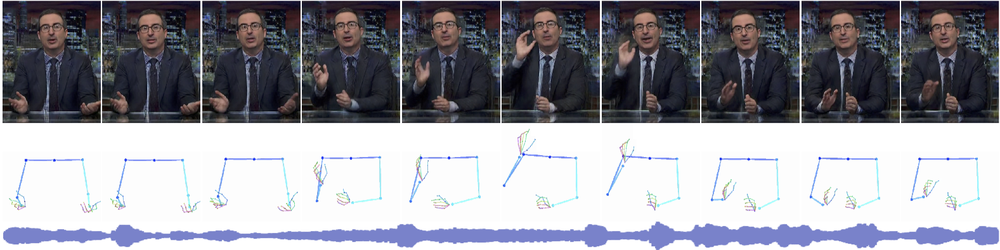
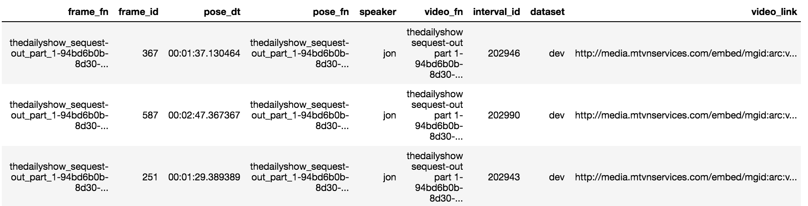

# Learning Individual Styles of Gestures - Data page
#### [Shiry Ginosar](http://people.eecs.berkeley.edu/~shiry) *, [Amir Bar](http://amirbar.github.io) *, Gefen Kohavi, [Caroline Chan](https://www.csail.mit.edu/person/caroline-chan), [Andrew Owens](http://andrewowens.com/), [Jitendra Malik](https://people.eecs.berkeley.edu/~malik/)
##### Back to [main project page](https://people.eecs.berkeley.edu/~shiry/projects/speech2gesture/index.html)

## Note:
The data for Conan was updated recently to remove duplicate videos. The numerical results on arxiv pertaining to Conan will be updated soon.

## Table of contents:
1. [Prerequisits for data download](#Prerequisits-for-data-download)
2. [Download specific speaker data](#Download-specific-speaker-data)
3. [Crop intervals containing frontal speaker](#Crop-intervals-containing-frontal-speaker)
4. [Reference](#reference)
5. [Changelog](#changelog)


## Prerequisits for data download
1. [Project prerequisites](https://github.com/amirbar/speech2gesture#prerequisites)
2. `OpenCV`
3. `youtube-dl`

## Download specific speaker data
### Frames.csv File

1. Create a base dataset folder named (e.g Gestures)
2. Download the file `frames_df.csv.tgz` from [here](https://drive.google.com/drive/folders/1qvvnfGwas8DUBrwD4DoBnvj8anjSLldZ). extract in the root path of base folder. This file contains a listing and metadata of all included files. 

After this step, this should be the contents of your base dataset folder:
```
Gestures
└── frames.csv
```


`frames.csv` is a csv file in which every row represents a single frame in the data.  


#### Columns documentation:
```
frame_fn - name of the frame file
pose_dt - frame time in the video
pose_fn - serialized file containing poses
speaker - name of a speaker in the dataset
video_fn - name of the video file
interval_id - unique id of the interval in which the frame appears. interval in this scope is a part of video in which the speaker appears in a clean, frontal way.
dataset - train/dev/test
video_link - video youtube link   
```

### Download speaker data

3. Download a single or multiple speakers keypoints & frames tar file [here](https://drive.google.com/drive/folders/1qvvnfGwas8DUBrwD4DoBnvj8anjSLldZ). Extract this file directly in the base folder. 
After this step, your dataset folder should be in the following structure:
```
Gestures
├── frames.csv
├── almaram
│   ├── frames
│   ├── keypoints_all
│   └── keypoints_simple
...
└── shelly
    ├── frames
    ├── keypoints_all
    └── keypoints_simple
```

4. Download the file containing all video links video_links.csv from [here](https://drive.google.com/drive/folders/1qvvnfGwas8DUBrwD4DoBnvj8anjSLldZ).
 
5. Download the speaker videos from youtube. Use the following script:
`python -m data.download.download_youtube --base_path </path/to/dataset base folder> --speaker <speaker_name>`

Speaker names include: 
oliver, jon, conan, rock, chemistry, ellen, almaram, angelica, seth, shelly


After this step, your dataset folder should be of the following structure:
```
Gestures
├── frames.csv
├── almaram
    ├── frames
    ├── videos
    ├── keypoints_all
    ├── keypoints_simple
    └── videos
...
└── shelly
    ├── frames
    ├── videos
    ├── keypoints_all
    ├── keypoints_simple
    └── videos
```

## Crop intervals containing frontal speaker

If you just want to use intervals containing frontal view of the speakers for any purpose, follow these instructions
1. Follow the [Download specific speaker data](#Download-specific-speaker-data) section
2. Download `intervals_df.csv` from [here](https://drive.google.com/drive/folders/1qvvnfGwas8DUBrwD4DoBnvj8anjSLldZ) and place it in the base path.
3. Run: 

```python -m data.download.crop_intervals --base_path </path/to/base folder> --speaker <optional, speaker_name> --output_path <output path to save intervals>```

---


Notes:
Currently, this script will only download youtube videos so all non-youtube links will be skipped. Broken video links will be skipped.

### Reference
If you found this code useful, please cite the following paper:


```
@InProceedings{ginosar2019gestures,
  author={S. Ginosar and A. Bar and G. Kohavi and C. Chan and A. Owens and J. Malik},
  title = {Learning Individual Styles of Conversational Gesture},
  booktitle = {Computer Vision and Pattern Recognition (CVPR)}
  publisher = {IEEE},
  year={2019},
  month=jun
}
```

### Changelog
10/19/19 - We've removed 22 duplicated videos in the dataset. We're now working to update the manuscript accordingly.
